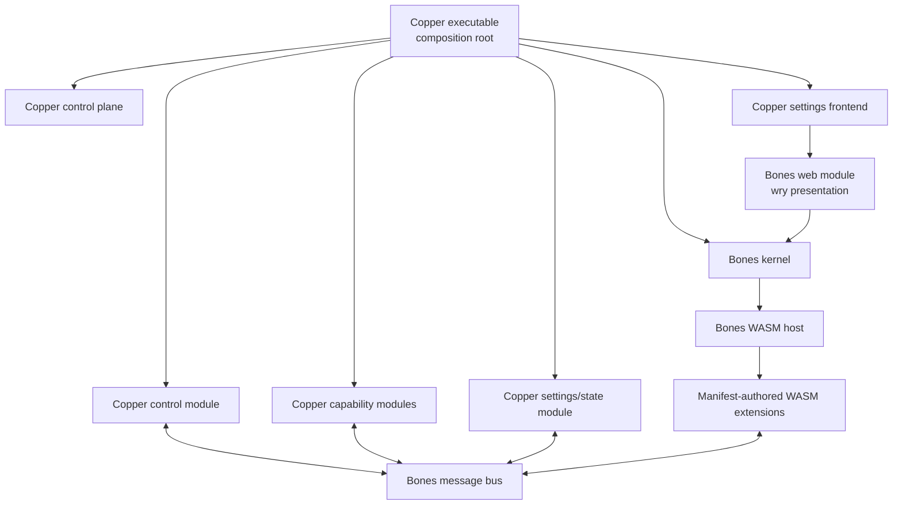

# Copper on Bones Migration Plan

Status: Implementation in progress
Plan owner: Copper maintainers  
Last updated: 2026-07-27

## 1. Purpose

Migrate Copper onto Bones while preserving Copper's observable behavior,
manifest-first extension contract, state, security boundaries, and
cross-platform build.

The target is a **big-bang release built through incremental, verifiable
construction**:

- development may temporarily contain compatibility adapters;
- every increment must leave a testable checkpoint;
- the released result must not retain two permanent architectures;
- cutover happens only after the new system passes the parity gates in this
  document.

This file is the durable source of truth for migration status. Update it when a
decision, dependency, milestone status, or exit criterion changes.

## 2. Accepted Architecture

Copper becomes an external Bones-based distribution. Copper does not become a
single WASM extension and does not use the stock Bones application as its
executable.



### 2.1 Copper owns

- `manifest.json` validation and compatibility;
- action, input, settings, status, platform, permission, and tray metadata;
- the daemon CLI and authenticated loopback control plane;
- the settings frontend, its message contract, and extension enable/disable
  workflows;
- `config.json`, `status.json`, store data, diagnostics, and migrations;
- authorization of host capabilities from manifest permissions;
- filesystem, shell, notification, keyboard, secure-store, tray, hotkey, and
  product-specific OS integrations;
- translation between Copper actions and Bones bus messages;
- the Bones composition root and extension activation policy.

### 2.2 Bones owns

- WASM Component loading and isolation;
- extension lifecycle, activation, hot reload, watchdog, and quarantine;
- message routing and host-stamped sender identity;
- native-module composition;
- the native settings window and webview lifecycle through its web presentation
  module (currently `wry`);
- generic platform primitives accepted into Bones through its ADR process.

### 2.3 Boundary rules

1. Copper depends on public Bones APIs only.
2. Copper-specific schemas and product policy do not move into Bones.
3. Generic Bones gaps are first proven through the Copper integration, then
   proposed upstream.
4. Manifest identity must agree with the runtime artifact identity.
   `manifest.id` equals the WASM file stem, and Copper passes that validated
   identity explicitly into the Bones catalog.
5. Native module message handlers must not perform blocking shell, filesystem,
   keychain, HTTP, or display work on the Bones event loop.
6. Extensions receive no ambient filesystem, network, process, environment, or
   stdio access. Capabilities are explicit and permission checked.
7. Copper's state store remains authoritative; Bones opaque persistence is not
   a replacement for Copper config or status state.
8. Headless operation remains available without mandatory renderer, webview,
   SDL window, or display-server dependencies.
9. The settings UI uses the Bones web presentation module when opened. The
   always-on daemon must not create a window or require a display merely to run.

## 3. Decision Register

Statuses: `ACCEPTED`, `PROPOSED`, `BLOCKED`, `SUPERSEDED`.

| ID | Status | Decision |
|---|---|---|
| D-001 | ACCEPTED | Copper is an external Bones distribution with native Copper modules and WASM product extensions. |
| D-002 | ACCEPTED | Delivery is one final cutover, constructed through incremental testable checkpoints. |
| D-003 | ACCEPTED | `manifest.json` remains the source of truth for extension metadata and permissions. |
| D-004 | ACCEPTED | Copper retains its control plane, settings UI, and structured state store. |
| D-005 | ACCEPTED | Blocking or long-running capabilities use asynchronous jobs and result events rather than synchronous Bones handlers. |
| D-006 | ACCEPTED | Expose a small Copper integration facade while splitting control, capability, state, and platform responsibilities into focused modules or crates. |
| D-007 | ACCEPTED | Use optional `runtime: { kind, abi, artifact }` metadata for WASM Components; absence retains schema 1.0 TypeScript compatibility. |
| D-008 | ACCEPTED | Rust is the supported Component authoring path for this cutover. The July 2026 TypeScript prototype could not build on Windows ARM64 because ComponentizeJS' Wizer package had no binary for that platform; TypeScript Components remain a future option after the toolchain is cross-platform, while Deno remains construction-only compatibility scaffolding. |
| D-009 | ACCEPTED | Use typed Bones messages for Bones-native lifecycle and extension control. Copper-owned action, capability, job, result, and error payloads use a versioned JSON envelope over the Bones byte-payload bus. |
| D-010 | ACCEPTED | Run the daemon through an event-driven headless Bones driver rather than a fixed 60 Hz loop. |
| D-011 | ACCEPTED | Migrate the Copper settings UI to the Bones web presentation module, currently backed by `wry`; Copper owns the frontend and message contract, while Bones owns native window/webview presentation. |
| D-012 | ACCEPTED | Open the detachable Bones wry presentation from Copper tray/CLI actions; the daemon engine remains headless and the explicit browser fallback remains available during migration. |

Changing an accepted decision requires documenting the reason in the change log.
Lasting changes to Bones architecture require a new Bones ADR; existing Bones
ADRs are not edited.

## 4. Definition of Done

The migration is complete only when all of the following are true:

- Copper starts, monitors, and shuts down as an always-on headless daemon on
  Windows, macOS, and Linux.
- Existing CLI and authenticated HTTP operations retain their behavior.
- Existing extension manifests remain discoverable and valid, or receive an
  automated, tested migration.
- Copper permissions are enforced at every capability boundary.
- Existing config, status, store, and secure-store data remain usable.
- The settings UI retains extension discovery, enable/disable, commands,
  dynamic options, status, and apply workflows.
- The settings UI is presented by the Bones web module rather than Tauri, while
  the daemon remains headless until the UI is requested.
- Main tray, extension tray, hotkey, and Windows display behavior retain parity
  on their supported platforms.
- All shipped extensions pass their migration acceptance tests.
- Faulting, flooding, or hanging WASM extensions cannot crash or indefinitely
  block Copper.
- Release packaging contains the Copper executable, manifests, WASM artifacts,
  schemas, and required UI assets.
- Deno and temporary runtime adapters are removed from the released
  architecture unless a separately accepted decision explicitly retains them.
- The full validation checklist in section 9 passes.

## 5. Explicit Non-Goals

- Replacing Copper manifests with `bones.toml` or filename-only metadata.
- Moving Copper settings screens or Windows display policy into Bones.
- Granting generic WASI filesystem, process, or network access for convenience.
- Shipping the stock Bones windowed application as Copper.
- Preserving Tauri as Copper's native settings-window backend.
- Preserving internal Rust module layout when observable behavior is unchanged.
- Maintaining the old and new runtime architectures indefinitely.
- Adding unrelated Bones renderer, game-core, audio, or game features to Copper.

## 6. Milestone Tracker

Statuses: `NOT STARTED`, `IN PROGRESS`, `BLOCKED`, `DONE`.

### M0 — Freeze the behavioral baseline

Status: **DONE**
Depends on: none

- [x] Correct stale runtime descriptions in `README.md` and
  `docs/ARCHITECTURE.md`.
- [x] Record the supported CLI, HTTP, UI, state, tray, hotkey, and extension
  behavior as executable parity tests.
- [x] Add negative security tests for undeclared permissions and unauthorized
  control-plane access.
- [x] Capture representative state fixtures for config, status, store, and
  legacy fallback migration.
- [x] Record platform-specific expectations for Windows, macOS, and Linux.

Exit criterion: the current implementation can be replaced while the parity
suite independently identifies missing behavior.

### M1 — Establish the external Bones composition root

Status: **DONE**
Depends on: M0

- [x] Add pinned Bones crates to the Copper workspace without adding Copper
  code to the Bones application.
- [x] Build Copper with a headless Bones engine.
- [x] Inject a minimal external Copper control module through the public Bones
  module API.
- [x] Preserve daemon start, health, reload, and shutdown behavior.
- [x] Decide D-010.
- [x] Prove headless builds do not require a window or display server.

Exit criterion: Copper runs its existing daemon lifecycle around an embedded,
headless Bones engine with no product extensions activated.

### M2 — Manifest catalog and lifecycle bridge

Status: **DONE**
Depends on: M1

- [x] Scan and validate Copper manifests before constructing the Bones engine.
- [x] Enforce manifest ID to artifact identity.
- [x] Map Copper disabled/platform-filtered extensions to the Bones startup
  allow-list.
- [x] Authorize the Copper controller for Bones runtime load, unload, and reload
  commands.
- [x] Translate `core/lifecycle` events into Copper health and status data.
- [x] Make manifest and component replacement transactional.
- [x] Decide D-007 and D-009.

Exit criterion: the Copper registry and Bones runtime report one consistent
catalog and lifecycle without executing Copper actions.

### M3 — Permissioned capability broker

Status: **DONE**
Depends on: M2

- [x] Define versioned action request, job, result, and error envelopes.
- [x] Authorize every request using the Bones host-stamped sender and its
  validated Copper manifest.
- [x] Implement asynchronous job execution outside the Bones event loop.
- [x] Add scoped store/config/status access backed by `ExtensionStateStore`.
- [x] Add notification and UI result routing.
- [x] Add filesystem and shell capabilities with least-privilege policy.
- [x] Add keyboard and secure-store capabilities.
- [x] Add Windows display capabilities behind platform gates.
- [x] Verify undeclared, cross-extension, malformed, and replayed requests fail
  safely.

Exit criterion: a test WASM component can execute each authorized Copper
capability, while all negative authorization tests pass and the Bones loop
remains responsive.

### M4 — Control plane, settings UI, and background behavior

Status: **DONE**
Depends on: M2, M3

- [x] Route CLI and HTTP triggers to versioned action messages.
- [x] Preserve authentication, loopback binding, health, list, reload, verify,
  trigger, and shutdown operations.
- [x] Preserve manifest-driven settings UI and state diagnostics.
- [x] Preserve dynamic options and apply-actions workflows.
- [x] Port the existing settings frontend to the Bones `web/*` bridge and
  `wry`-backed presentation module.
- [x] Replace native UI-specific HTTP fetches with versioned
  `copper.settings/1` Bones bus/web messages. The explicit browser fallback
  uses an ephemeral authenticated server; no settings server remains in the
  daemon lifecycle.
- [x] Open and close the native settings window on demand without restarting or
  stopping the daemon.
- [x] Remove the Tauri settings-window dependency after Bones presentation
  reaches parity.
- [x] Decide D-012, retaining the explicit external-browser fallback during
  migration.
- [x] Map background polling onto timers/jobs without a busy 60 Hz daemon loop.
- [x] Preserve main tray, additional extension trays, and UI launch behavior.
- [x] Preserve Safe Input Key hotkey behavior on Windows.

Exit criterion: Copper's daemon and management surfaces pass the M0 parity
suite while driving a Bones-backed runtime.

### M5 — Extension SDK and packaging

Status: **DONE**
Depends on: M3

- [x] Define the Copper guest SDK over the selected Bones message contract.
- [x] Generate bindings and authoring templates from the versioned contract.
- [x] Add deterministic Rust-to-Component build support.
- [x] Prototype TypeScript-to-Component compilation and measure artifact size,
  startup time, supported language features, clocks, randomness, and debugging.
- [x] Decide D-008 from the prototype evidence.
- [x] Validate manifests and runtime artifacts together.
- [x] Package `manifest.json` plus the selected runtime artifact.
- [x] Keep cross-platform PowerShell build and verification entry points.

Prototype evidence: `jco 1.26.0` with `componentize-js 0.21.0` generated guest
types for the complete Bones world and exposed feature gates for clocks,
randomness, stdio, HTTP, and all ambient WASI.
Compilation with every optional WASI feature disabled failed before producing
an artifact on Windows ARM64 because `@bytecodealliance/wizer` has no
precompiled `win32 arm64` binary. Artifact size, startup, and guest debugging
therefore could not be measured on the required platform. The Rust template
builds directly to `wasm32-wasip2`, is covered by the repository gate, and
remains deny-by-default in the Bones host.

Exit criterion: an AI author can generate, build, validate, package, and run a
new Copper WASM extension without knowledge of Copper host internals.

### M6 — Migrate shipped extensions

Status: **NOT STARTED**  
Depends on: M4, M5

| Order | Extension | Target | Status | Acceptance focus |
|---:|---|---|---|---|
| 1 | `session-counter` | WASM | NOT STARTED | scoped persistence and toast |
| 2 | `sort-downloads` | WASM | NOT STARTED | scoped filesystem read and notification |
| 3 | `desktop-torrent-organizer` | WASM | NOT STARTED | background jobs, file moves, settings, status |
| 4 | `safe-input-key` | WASM plus native capabilities | NOT STARTED | keychain, keyboard injection, hotkey |
| 5 | `windows-display-manager` | WASM plus native capabilities | NOT STARTED | platform gating, dynamic options, apply, tray |

For every extension:

- [ ] Add or update its UTR/parity tests first.
- [ ] Preserve manifest metadata and minimize permissions.
- [ ] Verify clean install and migration from representative existing state.
- [ ] Verify unsupported-platform behavior.
- [ ] Verify fault, timeout, and invalid-input behavior.
- [ ] Remove its legacy execution path after parity passes.

Exit criterion: all shipped extensions run through Bones and pass their
individual and system-level parity tests.

### M7 — Release cutover and cleanup

Status: **NOT STARTED**  
Depends on: M0–M6

- [ ] Run the full cross-platform validation matrix.
- [ ] Verify upgrades from the latest released Copper bundle.
- [ ] Remove Deno discovery, bridge, dry-run preparation, and other temporary
  adapters not accepted for the final architecture.
- [ ] Remove dead dependencies and legacy runtime code.
- [ ] Update architecture, development, testing, authoring, quickstart, and
  extension UI documentation.
- [ ] Update installers, autostart, release archives, and published extension
  packaging.
- [ ] Perform security review of capability authorization and control-plane
  exposure.
- [ ] Confirm no mandatory GUI dependency exists in the headless build.

Exit criterion: the Definition of Done is satisfied and the release candidate
contains only the new architecture.

### M8 — Upstream proven generic Bones improvements

Status: **NOT STARTED**  
Depends on: may proceed alongside M1–M7; must not block Copper unless required

Candidate improvements:

- [ ] Event-driven headless driver and explicit wake-up/timer integration.
- [x] On-demand creation and teardown of the window plus `wry` web presentation
  stack for an otherwise headless engine.
- [ ] Module logging and error-reporting improvements.
- [ ] Generic tray, notification, and global-hotkey platform primitives.
- [ ] Catalog metadata or host policy hooks that do not embed the Copper
  manifest schema.
- [ ] Generic asynchronous native-job messaging patterns.
- [ ] Transactional package/lifecycle hooks demonstrated by Copper.

Each upstream proposal must:

1. be useful independently of Copper product policy;
2. preserve a zero-presentation headless build;
3. use the Bones ADR and verification process;
4. land behind a pinned Copper-compatible Bones revision before Copper relies
   on it.

Exit criterion: accepted generic changes are upstream, while rejected or
product-specific changes remain clean external Copper modules.

## 7. Dependency Chain

```text
M0 → M1 → M2 → M3 → M4
                └──→ M5 → M6
M4 + M6 → M7
M8 runs alongside the chain when a generic upstream change is justified.
```

M0 is mandatory even for a one-loop AI implementation. Tests and state fixtures
are the stable memory of existing behavior when implementation context changes.

## 8. Risk Register

| Risk | Impact | Mitigation | Status |
|---|---|---|---|
| Copper behavior is inferred from stale documentation | Silent feature loss | M0 executable parity inventory; code is authoritative | OPEN |
| Blocking host calls stall the Bones loop | Daemon freeze or missed watchdog guarantees | Asynchronous jobs; never block module handlers | OPEN |
| Permission metadata is descriptive rather than enforced | Host compromise through an extension | Sender-based checks at every capability endpoint; negative tests | OPEN |
| Manifest and WASM artifact update separately | Wrong code executes under trusted metadata | Transactional package validation and reload | OPEN |
| TypeScript component tooling cannot preserve SDK ergonomics | Extension rewrite or large artifacts | Rust is the supported M5 authoring path; revisit ComponentizeJS only after Windows ARM64 and cross-platform reproducibility pass | MITIGATED |
| State format changes lose user configuration or secrets | User-visible data loss | Golden state fixtures and upgrade tests | OPEN |
| SDL/window requirements leak into daemon builds | Headless CI and servers break | Custom headless composition root and no mandatory presentation features | OPEN |
| Bones web presentation requires a window or main-thread event loop at daemon startup | Idle Copper is no longer headless or on-demand | Add lazy presentation lifecycle support and test tray/CLI open-close behavior | OPEN |
| Copper-specific features overgrow Bones | Coupled repositories and slow upstream review | External-first implementation and upstream acceptance criteria | OPEN |
| Native Copper modules crash in-process | Whole daemon exits | Small modules, defensive boundaries, worker isolation for risky work | OPEN |
| Long autonomous implementation drifts from intent | Large but incorrect rewrite | Milestone exit gates and parity suite before cleanup | OPEN |

## 9. Validation Gates

Every implementation milestone runs the checks proportionate to its scope.
Before M7 completes, all of these are mandatory:

```powershell
cargo fmt -p copperd --check
cargo test -p copperd --test extension_utr
./scripts/run-tests.ps1
cargo build --workspace --release
./scripts/build-release.ps1
./scripts/verify-loop.ps1 -Iterations 3
./scripts/coverage.ps1
```

Daemon smoke:

```powershell
./scripts/daemon.ps1 -Action run
./scripts/daemon.ps1 -Action health
./scripts/daemon.ps1 -Action shutdown
```

Additional migration gates:

- current-to-new state upgrade fixtures;
- manifest permission denial tests;
- WASM trap, timeout, queue flood, and malformed-message tests;
- headless build/run on Windows, macOS, and Linux;
- settings UI parity through the Bones `wry` presentation backend, including
  repeated open/close cycles;
- supported-platform tray/hotkey/display tests;
- install, autostart, update, and uninstall smoke tests;
- release archive inspection for schemas, manifests, components, and UI assets.

Coverage retains the existing double-audit rule from `AGENTS.md`.

## 10. Plan Maintenance

When updating this plan:

1. Change `Last updated`.
2. Change milestone and checklist statuses without deleting unfinished history.
3. Record architectural choices in the Decision Register.
4. Add newly discovered work to the earliest incomplete milestone whose exit
   criterion requires it.
5. Add scope that does not fit an existing milestone as a new milestone rather
   than silently expanding the final cutover.
6. Record material changes below.
7. Keep implementation detail in code and project documentation; keep this file
   focused on sequencing, decisions, dependencies, and acceptance.

### Change log

| Date | Change |
|---|---|
| 2026-07-26 | Initial plan: Copper as an external Bones distribution, incremental construction, single release cutover. |
| 2026-07-26 | Made migration of the settings UI to Bones' `wry`-backed web presentation module an accepted target. |
| 2026-07-26 | Started implementation and recorded the shipped extension contract baseline plus ADR-001. |
| 2026-07-26 | Completed M0 with state fixtures, security regressions, and restricted Deno permissions. |
| 2026-07-26 | Accepted D-006 and added Copper's first external module against the public Bones bus contract. |
| 2026-07-26 | Completed M1: accepted D-010, added the stepped daemon driver, and upstreamed an optional Bones presentation dependency boundary in ADR-027. |
| 2026-07-26 | Started M2 and accepted D-007 with an optional, identity-bound `copper.component/1` manifest artifact contract. |
| 2026-07-26 | Completed M2: Copper now supplies its filtered multi-root catalog to Bones, observes typed lifecycle state, delegates in-place component replacement to Bones' transactional supervisor, and accepted D-009 for versioned Copper-owned JSON envelopes. |
| 2026-07-26 | Started M3 with the `copper.bus/1` JSON envelope contract and a bounded direct-call capability queue that authorizes the Bones host-stamped sender against the active WASM manifest. |
| 2026-07-26 | Added the M3 asynchronous worker boundary and sender-scoped store, config, and status operations with direct targeted job-result delivery. |
| 2026-07-26 | Routed filesystem, shell, notification, and UI requests through the M3 worker with strict argument validation, manifest permission checks, and bounded shutdown behavior. |
| 2026-07-26 | Completed the M3 native handler set with keyboard and keychain operations plus a Windows-gated display family protected by the new additive `windows-display` permission. |
| 2026-07-26 | Started M4: CLI/HTTP component triggers now use targeted `copper.bus/1` action messages, and optional manifest schedules dispatch background actions at one-second resolution without polling the Bones frame loop. |
| 2026-07-27 | Accepted D-012 after upstreaming detachable native-module registration and a wry presentation that can repeatedly attach to the live headless Bones bus and fully close without restarting the engine. |
| 2026-07-27 | Completed the M4 settings cutover: the default UI now uses correlated `copper.settings/1` messages through Bones web/Wry, tray requests attach on the daemon main thread, the temporary browser fallback remains explicit, and Tauri was removed. |
| 2026-07-27 | Completed M5 with generated Rust guest bindings, a tested scaffold/build flow, and deterministic manifest-plus-runtime archives. Accepted D-008 after ComponentizeJS 0.21.0 failed its Windows ARM64 Wizer prerequisite; TypeScript Components are deferred and Rust is the cutover authoring path. |
